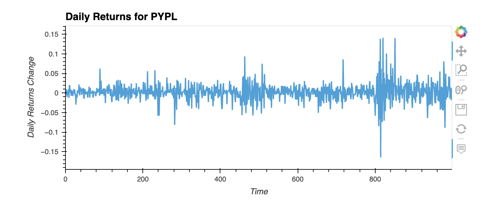
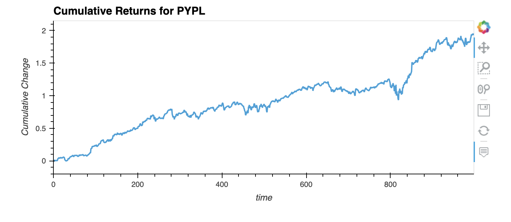
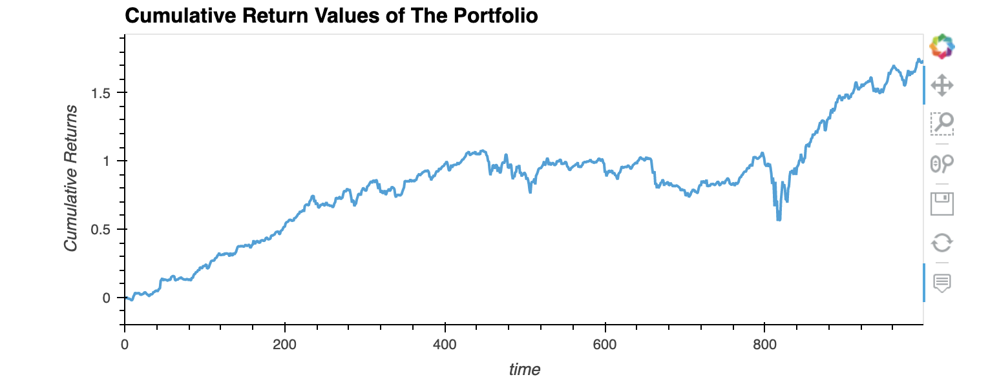

# ETF Analyzer through SQL

## Analysis Objective

In this analysis my objective was to analyze a single asset in the ETF that consist of four stocks: GDOT,GS,PYPL, and SQ.

## Stock Analaysis

The stock that I analyzed was "PYPL". Where I first just created dataframes so that I could check information such as: open, high,low,close,volume and daily returns.

## Plot Analysis

Once, I had all the informations that was needed. I then created an interactive plot to analyze the daily returns for "PYPL."

I then created a second interactive plot, in order to analyze the cumulative return.

## SQL Analysis

This part of my analysis consisted in a more investigative section, where I use SQL statements in order to further anaylys the data. I analzed the daily returns for "PYPL" so that I can see their returns by descending order in a limit of 10 results. 

## ETF Portfolio

### Step 1
This part of my analysis I used "inner join" to join each four stocks based on their "time" column. 
### Step 2
I then created a dataframe that averages the daily returns column for all of the four stocks.
### Step 3
With the dataframe from "step 2" I calculated the the anualized return for the portfolio. In order to achieve the result of "43.8%" I obtained the mean of the dataframe from "step 2" and then calculated that times 252 (trading days).
### Step 4
And last I obtained the cumulative return using the average daily returns and then plot an interactive plot. 

